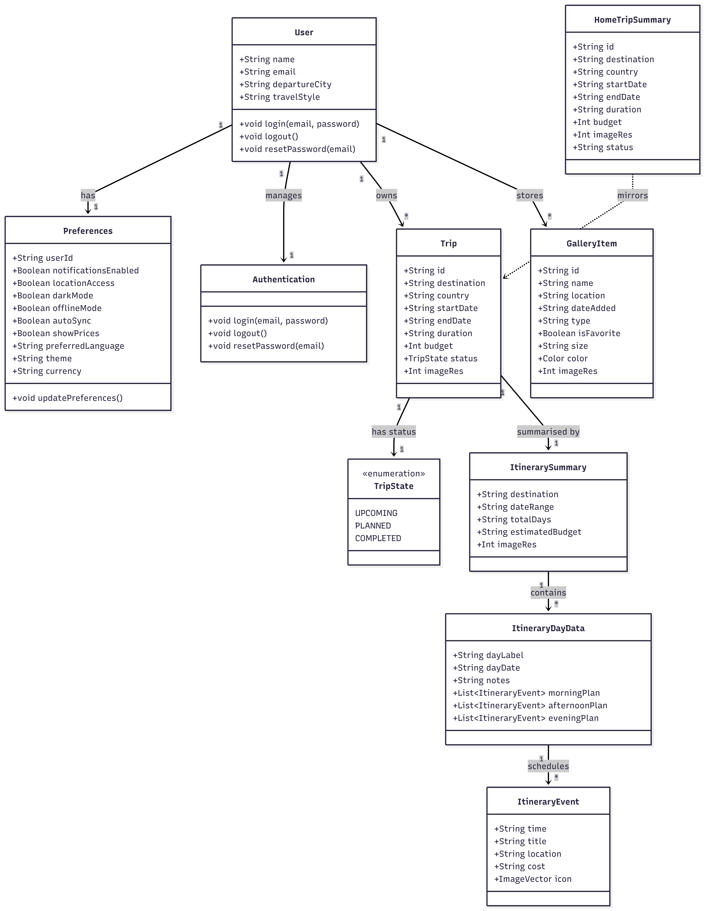

# 📐 Diseño Arquitectónico de VoyageTime

## 🏛️ Arquitectura General

VoyageTime sigue una arquitectura **single-module con separación por capas UI** basada en Jetpack Compose y Material Design 3, con navegación adaptativa mediante `NavigationSuiteScaffold`.

## 📊 Modelo de Datos: Diseñado y expandido para futuros Sprints

