## 1. T2.5 — Authentication Logcat cases

### Case A1 — Successful login with verified email

**Task covered:** T2.5

**Objective:**  
Verify that the application logs the authentication flow when a verified user logs in successfully.

**Preconditions:**

- Firebase is connected.
- Email/password authentication is enabled in Firebase.
- The user exists in Firebase Authentication.
- The user email is verified.

**Steps:**

1. Open the app.
2. Go to the login screen.
3. Enter the verified email.
4. Enter the correct password.
5. Press the login button.

**Expected UI result:**

The user is redirected to the main app screen.

**Logcat filter:**

```
package:com.example.voyagetime tag:FirebaseAuthRepository tag:LoginViewModel tag:MainActivity
```
**Logcat Image:**

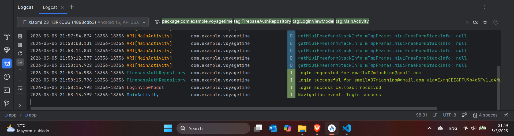


---

### Case A2 — Login blocked because email is not verified

**Task covered:** T2.5, T3.2

**Objective:**  
Verify that a Firebase user cannot access the app before verifying their email address.

**Preconditions:**

- The user exists in Firebase Authentication.
- The user has not clicked the email verification link.

**Steps:**

1. Open the app.
2. Enter the unverified email.
3. Enter the correct password.
4. Press the login button.

**Expected UI result:**

The login is rejected and the user remains on the login screen. An error message is displayed.

**Logcat filter:**

```
package:com.example.voyagetime tag:FirebaseAuthRepository tag:LoginViewModel
```

**Logcat image:**

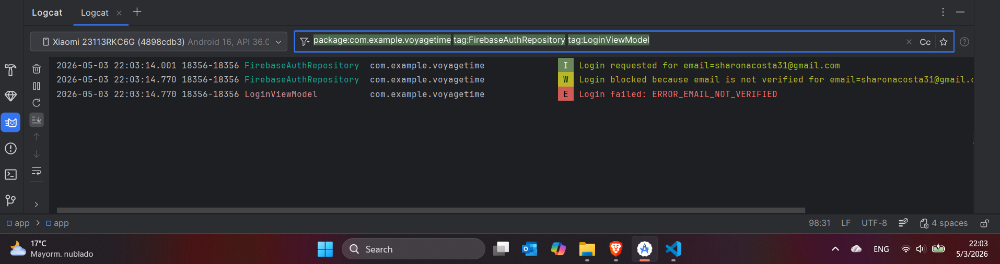


---

### Case A3 — Register user and send verification email


**Task covered:** T2.5, T3.2

**Objective:**  
Verify that the registration flow is logged and that Firebase sends an email verification message.

**Preconditions:**

- Firebase Authentication is configured.
- The username does not already exist in the local database.
- The email is not already registered in Firebase.

**Steps:**

1. Open the register screen.
2. Fill in username, email, password, birthdate, address, country, phone and email preference.
3. Accept the Terms and Conditions.
4. Press the create account button.

**Expected UI result:**

The account is created, the local user is saved, and the email verification is sent.

**Logcat filter:**

```
package:com.example.voyagetime tag:FirebaseAuthRepository tag:RegisterViewModel tag:UserRepository
```

**Logcat image:**

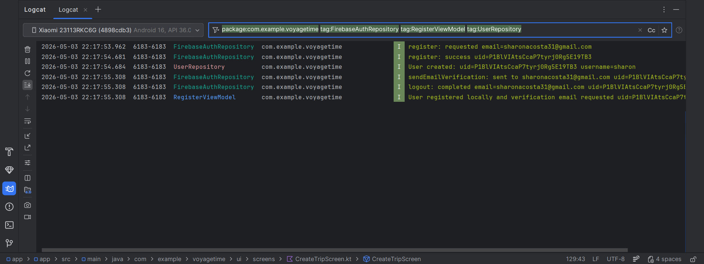


---

### Case A4 — Register error: duplicated username

**Task covered:** T2.5, T4.1, T5.2

**Objective:**  
Verify that the app rejects a username that already exists in the local database and logs the validation error.

**Preconditions:**

- A user with username `mia` already exists in the local Room database.

**Steps:**

1. Open the register screen.
2. Enter username `mia`.
3. Enter a different email.
4. Fill in the rest of the required fields.
5. Press the create account button.

**Expected UI result:**

The account is not created and the UI displays a username already used error.

**Logcat filter:**

```
package:com.example.voyagetime tag:RegisterViewModel tag:UserRepository
```

**Logcat image:**
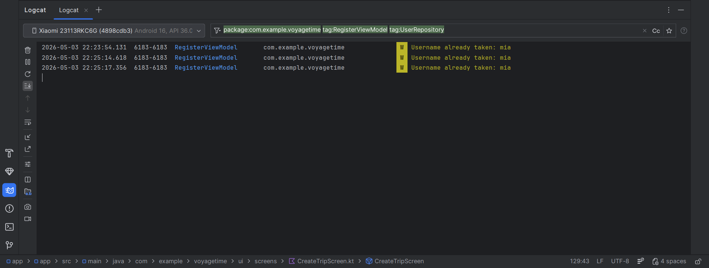


---

### Case A5 — Password recovery email

**Task covered:** T2.5, T3.3

**Objective:**  
Verify that the password recovery flow is logged and that Firebase sends a password reset email.

**Preconditions:**

- The email exists in Firebase Authentication.

**Steps:**

1. Open the login screen.
2. Open the forgot password screen.
3. Enter a registered email.
4. Press the recovery button.

**Expected UI result:**

The app shows a confirmation message and Firebase sends a password reset email.

**Logcat filter:**

```
package:com.example.voyagetime tag:FirebaseAuthRepository tag:ForgotPasswordViewModel
```

**Logcat image:**
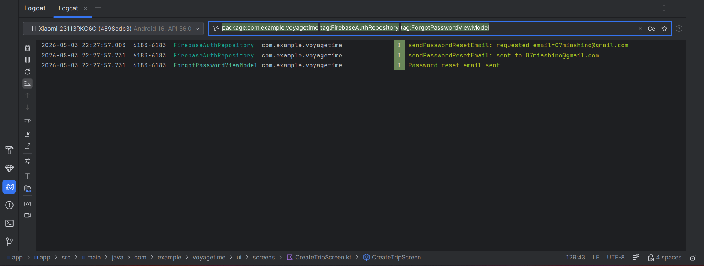


---

### Case A6 — Logout

**Task covered:** T2.5, T2.4, T4.4

**Objective:**  
Verify that logout is logged in Firebase Auth and persisted in the local access log table.

**Preconditions:**

- The user is logged in.

**Steps:**

1. Open the Preferences screen.
2. Press Log out.

**Expected UI result:**

The user is redirected to the login screen.

**Logcat filter:**

```
package:com.example.voyagetime tag:FirebaseAuthRepository tag:AccessLogRepository tag:MainActivity
```

**Logcat image:**

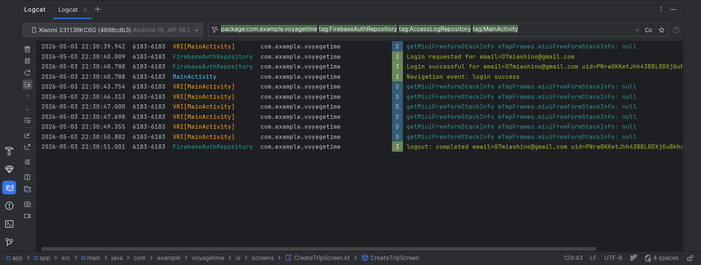


---

## 2. T5.2 — Data validation cases

### Case V1 — Duplicate trip destination for same user

**Task covered:** T5.2, T5.3

**Objective:**  
Verify that the same user cannot create two trips with the same destination.

**Preconditions:**

- The user is logged in.
- A trip with destination `Paris` already exists for this user.

**Steps:**

1. Open the Create Trip screen.
2. Create another trip with destination `Paris`.
3. Press the create/save button.

**Expected UI result:**

The second trip is rejected and a duplicate trip error is displayed.

**Logcat filter:**

```
package:com.example.voyagetime tag:CreateTripViewModel tag:TripRepository
```

**Logcat image:**

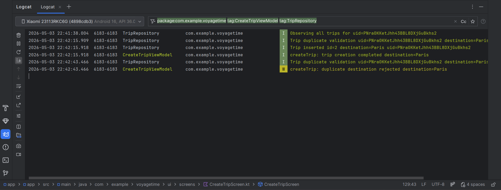


---

## 3. T5.3 — Database Logcat cases

### Case D1 — Insert trip

**Task covered:** T5.3

**Objective:**  
Verify that trip insertion is logged when a trip is saved in Room.

**Preconditions:**

- The user is logged in.
- The trip data is valid.
- The destination is not duplicated for the current user.

**Steps:**

1. Open the Create Trip screen.
2. Fill in all required fields.
3. Press the create/save button.

**Expected UI result:**

The trip is created and appears in Home/Trips.

**Logcat filter:**

```
package:com.example.voyagetime tag:CreateTripViewModel tag:TripRepository
```
**Logcat image:**
Same image as the previous test due to having the creation of a trip.


---

### Case D2 — Update trip

**Task covered:** T5.3

**Objective:**  
Verify that trip update operations are logged.

**Preconditions:**

- The user is logged in.
- At least one trip exists for the current user.

**Steps:**

1. Open the Trips screen.
2. Press Edit on an existing trip.
3. Change the destination, country, dates, budget or cover image.
4. Press Save.

**Expected UI result:**

The trip card updates with the new data.

**Logcat filter:**

```
package:com.example.voyagetime tag:TripRepository
```

**Logcat image:**

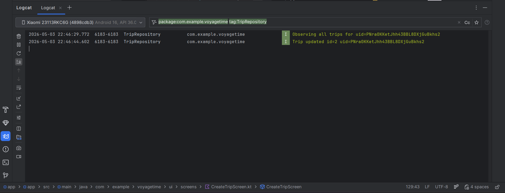


---

### Case D3 — Delete trip

**Task covered:** T5.3

**Objective:**  
Verify that trip deletion operations are logged.

**Preconditions:**

- The user is logged in.
- At least one trip exists for the current user.

**Steps:**

1. Open the Trips screen.
2. Press the delete button on a trip card.

**Expected UI result:**

The trip disappears from the Trips screen and from the local database.

**Logcat filter:**

```
package:com.example.voyagetime tag:TripRepository
```

**Logcat image:**

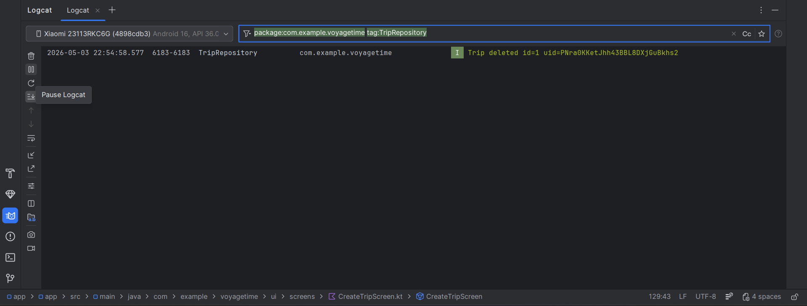


---

### Case D4 — Insert itinerary item

**Task covered:** T5.3

**Objective:**  
Verify that itinerary item insertion is logged when a new itinerary event is saved.

**Preconditions:**

- The user is logged in.
- A trip exists.
- The user is inside the Itinerary screen.

**Steps:**

1. Open a trip itinerary.
2. Press Add event.
3. Fill in the event data.
4. Save the event.

**Expected UI result:**

The itinerary event appears in the selected section.

**Logcat filter:**

```
package:com.example.voyagetime tag:ItineraryRepository
```

**Logcat image:**
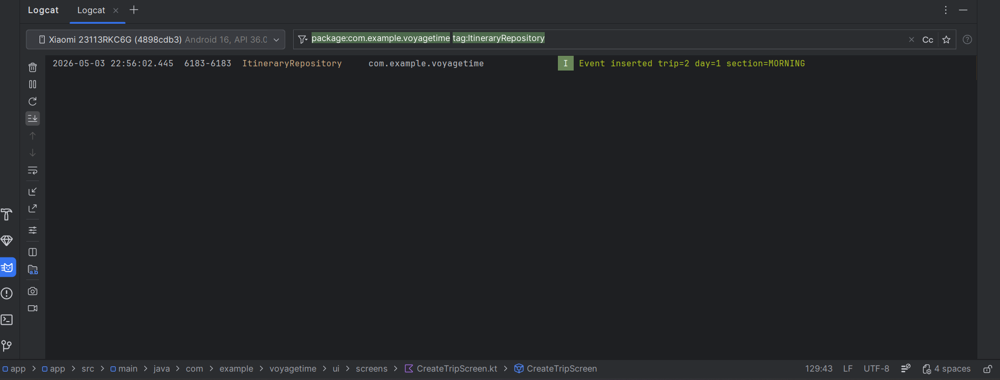
logcat_database_insert_itinerary


---

### Case D5 — Update itinerary item

**Task covered:** T5.3

**Objective:**  
Verify that itinerary item update operations are logged.

**Preconditions:**

- The user is logged in.
- A trip exists.
- At least one itinerary item exists.

**Steps:**

1. Open an itinerary.
2. Edit an existing event.
3. Save the changes.

**Expected UI result:**

The itinerary item updates in the UI.

**Logcat filter:**

```
package:com.example.voyagetime tag:ItineraryRepository
```

**Logcat image:**

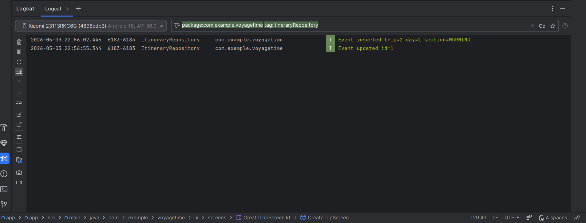

---

### Case D6 — Delete itinerary item

**Task covered:** T5.3

**Objective:**  
Verify that itinerary item deletion operations are logged.

**Preconditions:**

- The user is logged in.
- A trip exists.
- At least one itinerary item exists.

**Steps:**

1. Open an itinerary.
2. Delete an event.

**Expected UI result:**

The event disappears from the itinerary screen.

**Logcat filter:**

```
package:com.example.voyagetime tag:ItineraryRepository
```

**Logcat image:**

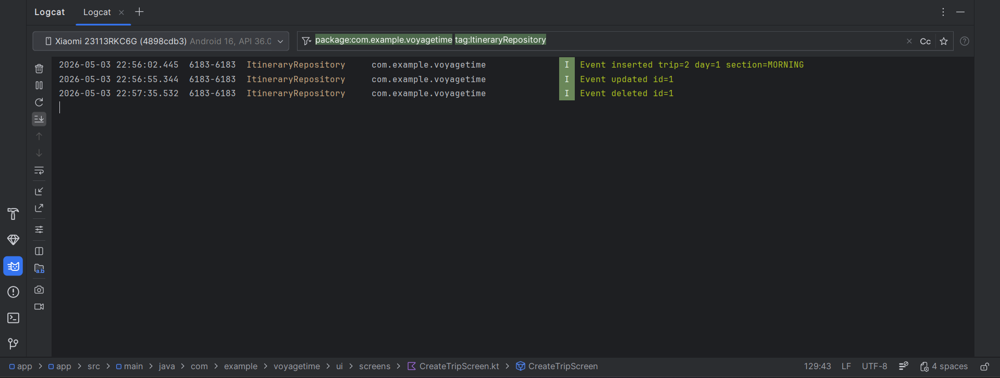

---

#### Case D8 - Login and logout access log

**Task covered:** T4.4, T5.3

**Objective:**  
Verify that every login and logout is stored in the local access log table and logged through Logcat.

**Preconditions:**

- The user exists in Firebase Authentication.
- The user exists in the local `users` table.
- The user email is verified.

**Steps:**

1. Log in with a verified user.
2. Open Logcat.
3. Log out from the Preferences screen.
4. Open Database Inspector.
5. Check the `access_logs` table.

**Expected UI result:**

The user logs in successfully and is redirected to the main app.  
After logout, the user is redirected to the login screen.

**Expected database result:**

The `access_logs` table contains one `LOGIN` record and one `LOGOUT` record for the user.

**Logcat filter:**

```
package:com.example.voyagetime tag:UserRepository
```


---

### Case D9 — Database operation error

**Task covered:** T5.3

**Objective:**  
Verify that Room/SQLite exceptions are caught and logged with `Log.e(...)`.

**Preconditions:**

- A database operation fails because of invalid state, invalid id, missing user id, or a Room/SQLite exception.

**Steps:**

1. Trigger an invalid database operation.
2. Observe the app response.
3. Check Logcat.

**Expected UI result:**

The app does not crash. A controlled error message is shown.

**Logcat filter:**

```
package:com.example.voyagetime tag:UserRepository 
```

**Logcat image:**

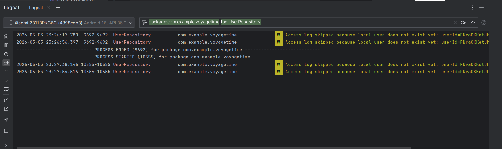